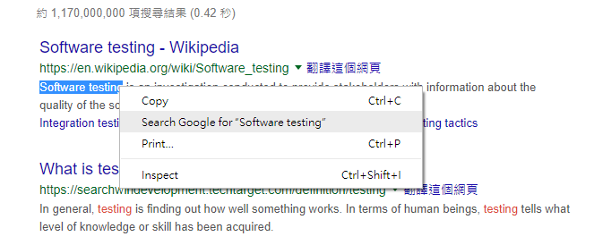
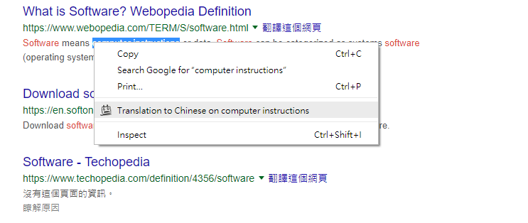
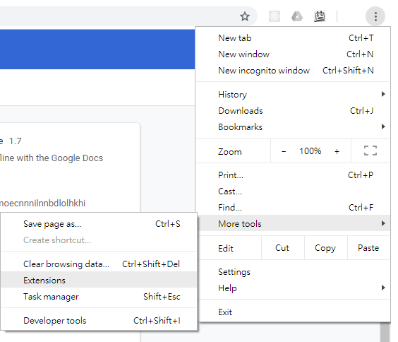
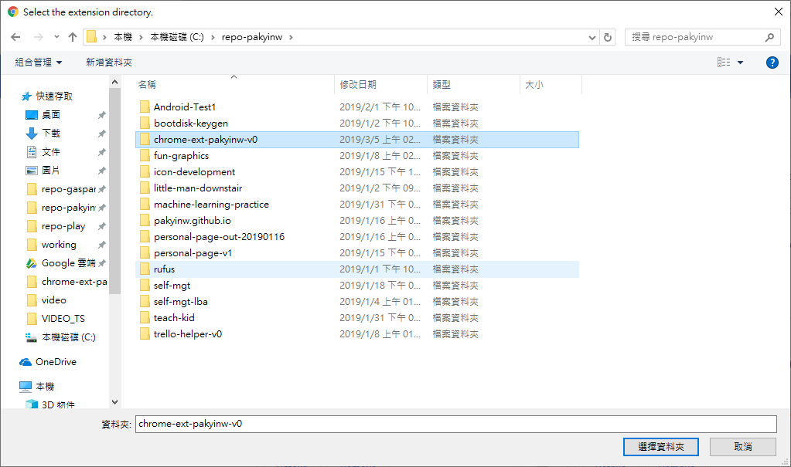

# chrome-ext-pakyinw-v0
This is a chrome extension for my self-use - learning language only. 

## Background
I want to translate the highlighted text but the current "Right click on highlighted text" only brings the search result.



## Target
I want the following function and therefore I develop this tool.



## Notes
- This one is a simple version and no longer in development
- I am developing another one for more functions -> chrome-ext-pakyinw

## Installation
1. Clone or download this repository
```
git clone https://www.github.com/pakyinw/chrome-ext-pakyinw-v0.git
```

2. Click the top right corner's "Extension" in Chrome.



3. Click the top left corner's "Load Unpacked" in Chrome.


4. Choose the cloned/downloaded folder.



## How to use
1. Right click or ctrl+b(Mac: Command+b) the highlighted text.

